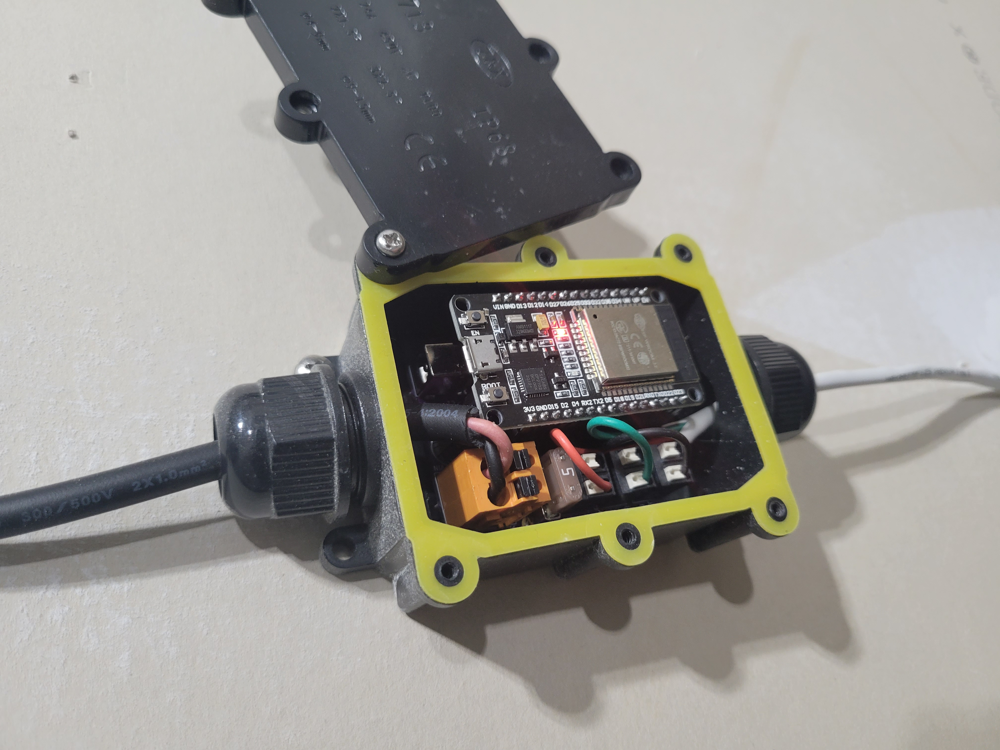

# Overview
This is one of those projects where it was a "problem" that I created. I decided that, after years of risking my life putting up Christmas lights, I was done. No, not done with Christmas lights, just the cycle. After taking inspiration from [The Hook Up](https://www.youtube.com/channel/UC2gyzKcHbYfqoXA5xbyGXtQ), and [DrZzs](https://www.youtube.com/c/DrZzs), I decided to install LED strips in a way that when they are off, you couldn't tell they were there. Where I deviated from those two installs was the need to wire each strip back to a central point. I wanted a decentralized solution that only required each strip have access to 120V, and the control would come via WiFi.

<image src="images/close_up_gutter.jpg" width="40%">&nbsp;&nbsp;&nbsp;&nbsp;
<image src="images/wall_mounted.jpg" width="40%">

# Details

Starting with the end goal: a device that is compatible with [WLED](https://kno.wled.ge/), has integrated WiFi (required for my decentralized configuration), and is small enough to fit inside a IP68(weatherproof) box for those lawn ornaments. I landed on the ESP32 in a NodeMCU configuration. From there the only thing that was lacking was a way to interface the ESP32 to the LED strips/strings. To solve this problem I designed a board using [KiCAD](https://www.kicad.org/).

## Requirements for board:
- Interface with an ESP32 \([Amazon](https://www.amazon.com/gp/product/B086MJGFVV), [AliExpress](https://www.aliexpress.com/item/1005001757645011.html)\)
- Provide connection for bare wire, or barrel jack (for interior use such as kitchen cabinets), from supply
- Provide connection for bare wire to LED strips
- Provide some voltage and current protection
- Step down input voltage to a level the LDO on the ESP32 can tolerate (5V)
  - The voltage regulator has the ability to run at 100% duty cycle making the board 5V and 12V compatible
- Step up the data line voltage to 5V
- All fit inside a [IP68 Box](https://www.amazon.com/gp/product/B07TGHYQF4)

# Materials

<image src="images/pcb_assembled.jpg" width="40%">&nbsp;&nbsp;&nbsp;&nbsp;

## Board
- [PCB](https://oshpark.com/shared_projects/z9dy7YqV)
- [Components](bom.csv) from [Digikey](https://www.digikey.com/)

## LED Strips
- [IP65 WS2815 12V](https://www.amazon.com/BTF-LIGHTING-Upgraded-Individually-Addressable-Non-Waterproof/dp/B07LG6KQ55)

## Hardware
- [IP68 Box](https://www.amazon.com/gp/product/B07TGHYQF4)
- [V-Shaped Channel](https://www.amazon.com/gp/product/B07F6FKGPH) for under the gutters
- [Low Profile Channel](https://www.amazon.com/gp/product/B07KDSYLGG) for the flat surface around the garage

## Supply
- [60W IP67](https://www.amazon.com/gp/product/B07MZP9247)

## ESP32 Firmware

For the firmware I use [WLED](https://kno.wled.ge/). If new to this I recommend starting [here](https://kno.wled.ge/basics/getting-started/).

# Steps
1. Order materials

2. Assemble board

<image src="images/sch.png" width="30%">

3. Plug ESP32 into carrier board and power up

4. [Flash ESP32 with WLED](https://kno.wled.ge/basics/install-binary/)

# Tips
- For the flat aluminum channel around the garage, with about 1/8" of the side of the channel exposed, I wanted it to blend in with the white trim. I ended up using some [self etching primer](https://www.lowes.com/pd/Rust-Oleum-Stops-Rust-Flat-Gray-Spray-Primer-Actual-Net-Contents-12-oz/3728805), and white spray paint.